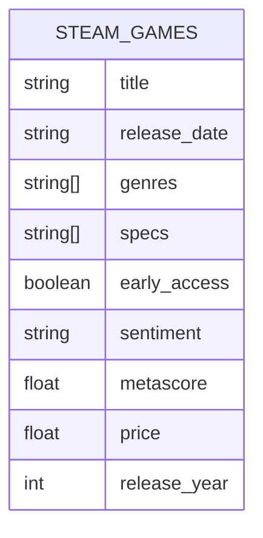

# Arquitectura del Sistema MLOps

Este documento describe la arquitectura, el flujo de datos y las transformaciones principales del proyecto de Machine Learning Operations (MLOps) para la recomendación y análisis de juegos de Steam.

## 1. Diagrama ER de Base de Datos (Conceptual)

Aunque el sistema utiliza archivos planos (`JSON` y `CSV`) en lugar de una base de datos relacional tradicional, la estructura de datos se puede conceptualizar de la siguiente manera:

### Fuentes de Datos
*   **steam_games.json**: Fuente principal para consultas de analítica (géneros, specs, juegos por año). Contiene datos semi-estructurados (listas en `genres` y `specs`).
*   **steam_games.csv**: Fuente procesada utilizada específicamente para el entrenamiento del modelo de Machine Learning. Contiene datos tabulares limpios.

## 2. Flujo de Datos End-to-End

El flujo de información desde la carga de datos hasta la respuesta al usuario es el siguiente:

1.  **Ingesta de Datos (ETL On-Demand)**:
    *   Al iniciar la aplicación (`main.py`), se carga `steam_games.json` en memoria.
    *   Se realiza un parsing línea por línea usando `ast.literal_eval` para manejar el formato JSON.
    *   Se convierte a un DataFrame de Pandas (`df`) que reside en la memoria de la aplicación FastAPI.

2.  **Procesamiento de Consultas (API Endpoints)**:
    *   El usuario realiza una petición HTTP (GET) a un endpoint (ej. `/genres/2010`).
    *   **Filtrado**: El sistema filtra el DataFrame principal por `release_date` coincidente con el año solicitado.
    *   **Transformación**: Se aplican operaciones de agregación (`value_counts`), explosión de listas (`explode`) o ordenamiento (`sort_values`).
    *   **Respuesta**: Se devuelve un objeto JSON con los resultados.

3.  **Machine Learning (Inferencia)**:
    *   El usuario consulta el endpoint `/prediction_price`.
    *   **Carga de Modelo/Datos**: La función `prediction` en `model.py` carga `steam_games.csv`.
    *   **Preprocesamiento**:
        *   Selección de features: `release_year`, `early_access`, `metascore`.
        *   Eliminación de nulos (`dropna`).
        *   Codificación de variables categóricas (`pd.get_dummies`).
    *   **Entrenamiento (On-Demand)**: Actualmente, el modelo `LinearRegression` se entrena en cada petición (nota: esto es un punto de mejora para producción, idealmente se debería persistir el modelo).
    *   **Predicción**: Se genera el precio estimado y el RMSE del modelo.

## 3. Transformaciones Principales

Las manipulaciones de datos clave que ocurren en el sistema son:

### Analítica (API)
1.  **Explode (Desanidado)**:
    *   *Input*: Una fila con una lista de géneros `['Action', 'Adventure']`.
    *   *Output*: Dos filas, una para 'Action' y otra para 'Adventure'.
    *   *Uso*: Endpoints `/genres` y `/specs` para contar frecuencias reales por categoría.

2.  **Filtrado por Fecha**:
    *   `mask = df['release_date'].str.startswith(year, na=False)`
    *   Permite seleccionar juegos de un año específico sin necesidad de convertir toda la columna a tipo datetime, manteniendo la flexibilidad con formatos variados.

### Machine Learning
1.  **Limpieza de Nulos**:
    *   Eliminación estricta de filas que no tengan valores en `release_year`, `early_access` o `metascore` para garantizar la estabilidad del entrenamiento.

2.  **One-Hot Encoding**:
    *   Uso de `pd.get_dummies()` para convertir variables categóricas (como `early_access`) en representaciones numéricas binarias que el modelo de Regresión Lineal pueda interpretar.
