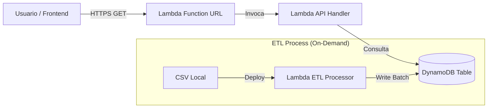

# ☁️ Arquitectura Serverless AWS (Capa Gratuita)

Este documento describe la arquitectura implementada en AWS para el procesamiento y exposición de datos de Steam Games, optimizada para **costo cero** utilizando el Free Tier.

## 📐 Diagrama de Flujo



## 🛠️ Componentes

### 1. Base de Datos: Amazon DynamoDB
*   **Tabla**: `steam_games`
*   **Partition Key**: `game_id` (String)
*   **Capacidad**: **Provisioned (5 RCU / 5 WCU)** - Dentro del Free Tier (25 RCU/WCU).
*   **Uso**: Almacena los metadatos procesados de los juegos.

#### ¿Por qué Provisioned en lugar de On-Demand?
- **Costo Predecible**: Para cargas bajas (<1,000 requests/mes), Provisioned es más económico.
- **Free Tier**: AWS ofrece 25 RCU/WCU gratuitas en modo Provisioned.
- **Throughput Suficiente**: 5 RCU/WCU soportan ~5 lecturas/segundo (suficiente para demos).

#### Cambiar a On-Demand (si se requiere escalado automático):
```bash
aws dynamodb update-table \
  --table-name steam_games \
  --billing-mode PAY_PER_REQUEST
```

### 2. ETL: AWS Lambda (`steam-etl-processor`)
*   **Función**: Carga datos masivos desde un CSV empaquetado.
*   **Runtime**: Python 3.11
*   **Optimizaciones**:
    *   **Layers**: Usa `AWSSDKPandas-Python311` para incluir Pandas/Numpy sin aumentar el tamaño del paquete.
    *   **Batch Writer**: Escritura optimizada en DynamoDB para reducir tiempo de ejecución.
    *   **Decimal Support**: Conversión automática de tipos float a Decimal.

### 3. API: AWS Lambda (`steam-api-processor`)
*   **Función**: Expone endpoints REST para consultar DynamoDB.
*   **Exposición**: **Lambda Function URL** (Reemplazo gratuito de API Gateway).
*   **Autenticación**: `NONE` (Pública para demos).
*   **CORS**: Configurado para permitir acceso desde cualquier origen (`*`).

## 🚀 Despliegue Automatizado
El proyecto utiliza scripts de PowerShell (`deploy.ps1`) que interactúan con AWS CLI para:
1.  Empaquetar código en ZIPs optimizados (< 2MB).
2.  Gestionar actualizaciones de código (CI/CD manual).
3.  Configurar permisos IAM automáticamente.
4.  Vincular Layers y Function URLs.

## 💰 Análisis de Costos (Estimado)

| Servicio | Uso Mensual | Límite Free Tier | Costo |
|----------|-------------|------------------|-------|
| **Lambda** | ~1,000 invocaciones | 1,000,000 requests | **$0.00** |
| **DynamoDB** | ~3,000 items (storage) | 25 GB storage | **$0.00** |
| **Data Transfer** | < 1 GB | 100 GB | **$0.00** |
| **S3** | 0 GB (No usado) | 5 GB | **$0.00** |

**Total Mensual: $0.00**

---
*Arquitectura diseñada por NEXUS MLOps Team.*
