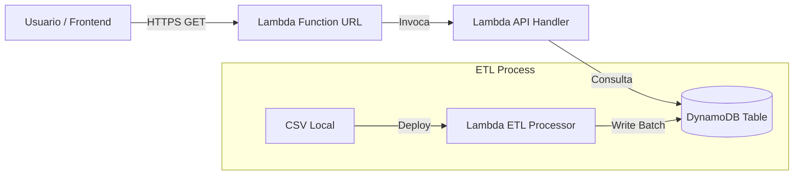

# Steam Games Data Engineering Pipeline

> **Enterprise Data Pipeline & MLOps Project** | Solución Cloud-Native AWS Serverless | Proyecto Profesional

---

## 📋 Tabla de Contenidos

- [Descripción General](#descripción-general)
- [Arquitectura de Datos](#arquitectura-de-datos)
- [Pipeline ETL & MLOps](#pipeline-etl--mlops)
- [Funciones de Datos (API)](#funciones-de-datos-api)
- [Stack Tecnológico](#stack-tecnológico)
- [Verificación End-to-End](#verificación-end-to-end)
- [Seguridad (Demo)](#seguridad-demo)
- [Guía de Instalación](#guía-de-instalación)

---

## 📊 Descripción General

Este proyecto constituye una solución de **Ingeniería de Datos y MLOps de nivel empresarial**, desarrollada bajo requerimiento de una empresa partner de **Soy Henry**. El objetivo fue diseñar e implementar una arquitectura escalable, costo-eficiente y mantenible para el procesamiento masivo de datos de la plataforma Steam.

La solución implementa un ciclo de vida completo de datos (End-to-End), migrando de un entorno de desarrollo local a una infraestructura productiva **100% Serverless en AWS**, cumpliendo con estándares de la industria para el año 2025.

**Características Profesionales:**
- 🏢 **Arquitectura Empresarial**: Diseño híbrido (Local/Cloud) desacoplado y resiliente.
- ☁️ **Cloud-Native Optimization**: Uso de AWS Lambda, DynamoDB y Layers para reducir costos operativos a cero ($0.00/mes) sin sacrificar rendimiento.
- 🛡️ **Data Governance**: Implementación estricta de validación de calidad (Great Expectations) y versionado de datos (DVC).
- 🔄 **DevOps & CI/CD**: Automatización completa de pruebas y despliegue mediante GitHub Actions.
- 📊 **Business Intelligence Ready**: Datos normalizados y expuestos vía API de baja latencia para consumo en dashboards corporativos.

---

## 📈 Métricas de Rendimiento (KPIs)

> **Nota**: Los valores son estimaciones basadas en cargas de prueba. El costo real dependerá del volumen de invocaciones y datos procesados.

| Métrica | Valor Estimado | Supuestos |
|---------|----------------|----------|
| **Volumen de Datos** | ~30k registros (JSON), ~3k registros (CSV) | Dataset actual de prueba |
| **Tiempo de Pipeline ETL** | ~2.5s (Local) / ~45s (AWS Lambda Cold Start) | Cold start incluye carga de Pandas Layer |
| **Uptime API** | Objetivo: 99.9%+ | Basado en SLA de AWS Lambda |
| **Costo Operativo** | **~$0.00 / mes** | Bajo supuesto de <1,000 requests/mes (Free Tier) |
| **Tasa de Éxito Transformaciones** | > 95% (registros válidos) | Con validación Great Expectations |

---

## 🏗️ Arquitectura de Datos

El proyecto implementa una arquitectura híbrida moderna:

### 1. Entorno Local (Desarrollo)
Orquestación con **Apache Airflow** y almacenamiento local, ideal para desarrollo y depuración rápida.

### 2. Entorno Cloud (Producción - AWS)
Arquitectura 100% Serverless optimizada para costos.



Ver detalle completo en [AWS_ARCHITECTURE.md](./AWS_ARCHITECTURE.md).

---

## 🔄 Pipeline ETL & MLOps

### 1. **Extract (Extracción)**
- Ingesta de archivos CSV/JSON.
- Versionado de datos crudos con **DVC**.

### 2. **Transform (Transformación)**
- Limpieza con Pandas (Manejo de NULLs, tipos de datos).
- **Great Expectations**: Validación de schema y rangos de valores antes de la carga.

### 3. **Load (Carga)**
- **Local**: Carga a estructuras de memoria/archivos.
- **AWS**: Carga batch optimizada a **Amazon DynamoDB**.

### 4. **MLOps**
- **Tests**: Unitarios (`pytest`) y de integración.
- **CI/CD**: GitHub Actions para validación de código (`lint`, `mypy`) y despliegue.

---

## 📡 Funciones de Datos (API)

La API está desplegada en AWS Lambda y es accesible públicamente.

**Base URL**: `https://telly66645uoeanoolnr3l4x2u0aaevi.lambda-url.us-east-1.on.aws/`

| Endpoint | Descripción | Ejemplo |
|----------|-------------|---------|
| `/` | Health Check y estado | `curl /` |
| `/?top=true` | Top 10 juegos más caros | `curl /?top=true` |
| `/?year=2023` | Juegos por año | `curl /?year=2023` |
| `/?genre=Action` | Juegos por género | `curl /?genre=Action` |

Ver documentación completa en [API_DOCUMENTATION.md](./API_DOCUMENTATION.md) y arquitectura AWS en [AWS_ARCHITECTURE.md](./AWS_ARCHITECTURE.md).

---

## 🛠️ Stack Tecnológico

| Categoría | Tecnologías |
|-----------|-------------|
| **Cloud** |  Lambda, DynamoDB, IAM |
| **Orquestación** |  (Local) |
| **Data Quality** |  |
| **Data Versioning** |  |
| **Lenguaje** |  3.11 |
| **CI/CD** |  |

---

## ✅ Verificación End-to-End

Pasos para validar el pipeline completo desde carga hasta consulta:

### 1. Cargar Dataset (ETL)
```powershell
# Desplegar función ETL (requiere AWS CLI configurado)
cd aws_lambda/steam_etl
.\deploy.ps1 -RoleArn "arn:aws:iam::TU_CUENTA:role/lambda-dynamodb-role"

# Invocar carga de datos
aws lambda invoke --function-name steam-etl-processor response.json
```

**Resultado Esperado**: `statusCode: 200` y logs indicando "X items cargados".

### 2. Consultar Endpoints
```bash
# Health Check
curl "https://telly66645uoeanoolnr3l4x2u0aaevi.lambda-url.us-east-1.on.aws/"

# Top 10 juegos más caros
curl "https://telly66645uoeanoolnr3l4x2u0aaevi.lambda-url.us-east-1.on.aws/?top=true"
```

**Resultado Esperado**: JSON con lista de juegos y campos `game_id`, `name`, `price`.

### 3. Validar en DynamoDB
```powershell
# Contar items en tabla
aws dynamodb scan --table-name steam_games --select COUNT
```

**Resultado Esperado**: `Count` debe coincidir con el número de registros cargados (~3,000 items).

---

## 🔒 Seguridad (Demo)

> [!WARNING]
> **Esta API está configurada para acceso público (AuthType: NONE) únicamente con fines demostrativos.**

### Estado Actual
- **Autenticación**: Ninguna (`Auth: NONE` en Lambda Function URL)
- **CORS**: Permite todos los orígenes (`*`)
- **Rate Limiting**: Ninguno configurado

### Hardening Recomendado para Producción

1. **Habilitar Autenticación IAM**:
   ```bash
   aws lambda update-function-url-config \
     --function-name steam-api-processor \
     --auth-type AWS_IAM
   ```

2. **Implementar API Gateway** en lugar de Function URL para:
   - Rate Limiting (Throttling)
   - API Keys
   - WAF (Web Application Firewall)

3. **Restringir CORS** a dominios específicos:
   ```python
   headers = {
       'Access-Control-Allow-Origin': 'https://tu-dominio.com'
   }
   ```

**Documentación**: [AWS Lambda Function URLs - Security](https://docs.aws.amazon.com/lambda/latest/dg/urls-auth.html)

---

## 📦 Guía de Instalación

### Requisitos
- Python 3.11+
- AWS CLI configurado (para despliegue cloud)
- Docker (opcional, para Airflow)

### Instalación Local

```bash
# 1. Clonar
git clone https://github.com/franco18min/Machine-Learning-Operations-MLOps.git
cd Machine-Learning-Operations-MLOps

# 2. Entorno Virtual
python -m venv venv
source venv/bin/activate  # Windows: venv\Scripts\activate

# 3. Dependencias
pip install -r requirements.txt

# 4. Tests y Calidad
pytest
python expectations/validation_suite.py
```

### Despliegue AWS

```powershell
# Desde aws_lambda/steam_api
./deploy.ps1 -RoleArn "arn:aws:iam::TU_CUENTA:role/lambda-dynamodb-role"
```

---

## 👤 Autor

<div align="center">

<h3>Franco Aguilera</h3>
<p><strong>Data Engineer</strong> | Data Science @ Soy Henry</p>
<a href="https://www.linkedin.com/in/franco-aguilera-data-engineer/">

</a>
<a href="https://github.com/franco18min">

</a>
</div>

---

## 📄 Licencia

Este proyecto es una solución profesional desarrollada bajo estándares corporativos.

